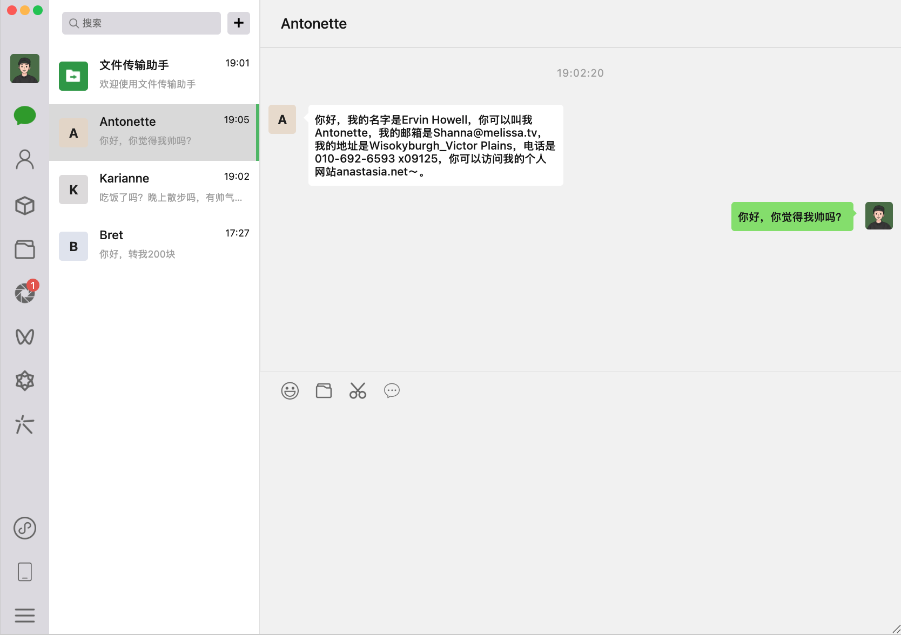
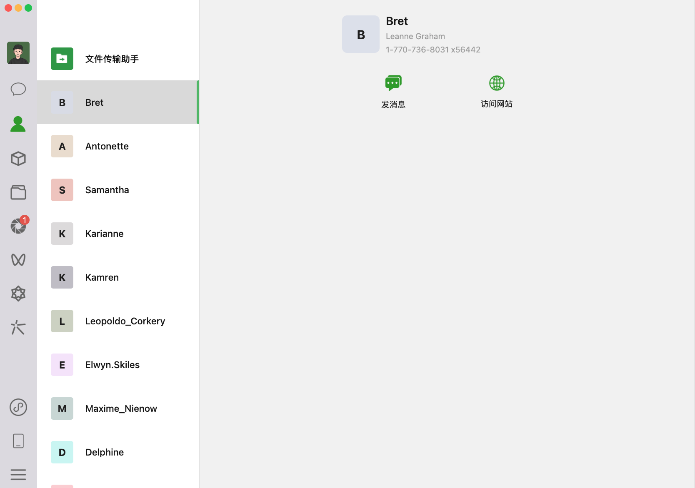
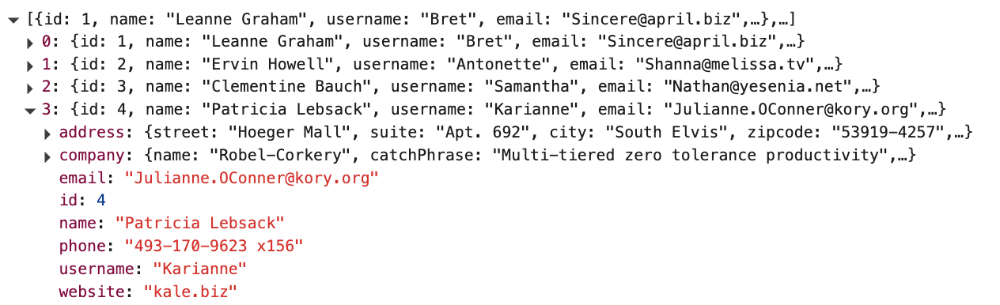
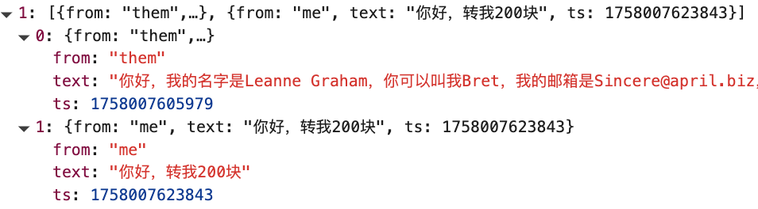
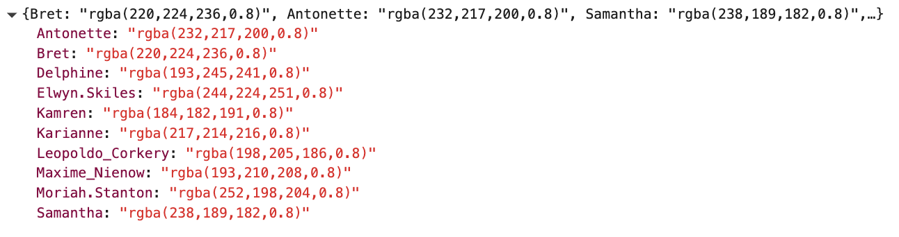

# Dynamic Website 微信网页端动态网站开发

Description: HTML + CSS + JavaScript 实现动态页面

- 知识点1: JavaScript 基础知识
- 知识点2: DOM 操作
- 知识点3: 事件处理
- 知识点4: AJAX 技术
- 知识点5: 路由体系
- 知识点6: 本地存储

### 👉点击此处完整界面👈

## 设计流程和思路

#### **页面（chat & user）HTML框架设计**

​	整体页面分为两个核心视图：**聊天页面（chat）和联系人页面（user）**，二者通过哈希路由进行切换。每个页面由三个区域构成: 左侧`sidebar`区域 (包含顶部三个圆点，用户头像，功能图标) , 中间联系人`chat-list`区域 (包括顶部搜索栏以及最近聊天对象), 右侧聊天窗口`chat-window`区域 (包括顶部聊天对象名称`chat-name`, 中间聊天内容`chat-box`，底部发送窗口`send-message`)。

- ***左侧区域 Sidebar***

  包含顶部的系统窗口圆点、用户头像及功能图标

  - 部分图标为按钮，点击后通过 Hash 路由跳转到 *#user* 或 *#chat* 页面
  - 底部保留扩展功能入口（如小程序、设置等）

- ***中间联系人区域（chat-list / users-scroll）***

  - 文件传输助手始终置顶，且单独实现高亮逻辑

  - 列表添加滚动条防止溢出

  - 交互: 每个用户部分绑定点击高亮显示

  - Chat page
    - 根据LocalStorage动态渲染（根据时间戳排序）
    - 页面根据LocalStorage显示最后聊天时间和最后一条消息

  - User page
    - 需通过fetch获取联系人数据   (接口地址：https://jsonplaceholder.typicode.com/users)
    - 随机生成联系人头像颜色和信息，保存LocalStorage便于重复使用

- ***右边聊天窗口（chat-window)***

  - Chat page

    - 顶部显示当前会话名称
    - 从LocalStorage获取当前用户聊天创建时间

    - 聊天气泡 + 小三角样式 (左白右绿)，气泡可根据文本自动调整宽度并设置最大限制

    - 添加滚动条，且默认展示消息底部

    - 底部为发送区域，绑定键盘事件 (回车发送)，输入内容会保存到 LocalStorage 并实时更新页面

  - User page

    - 从LocalStorage获取当前用户信息（用户名、电话、网站链接等）

    - 设置发消息按钮和用户web a标签

    - 发消息按钮绑定哈希路由\#chat?id=${user.id}并渲染

    - 首次进入会话自动回复并存入LocalStorage

      

#### 设计LocalStorage存储设计

为保证数据的持久化和一致性，系统在浏览器端定义了三个本地存储对象：

- user-info

  - 存储用户姓名，联系方式等基本信息

  - 数据来源于远程 fetch 接口，首次加载后写入 LocalStorage

  - 存储格式

    

- chat-history 

  - 存储每个会话的消息数组，结构包括发送方（me/them) 、消息文本以及时间戳
  - 页面渲染时根据此对象动态加载会话列表与消息流
  - 新消息发送时会追加写入，并触发会话区与消息区的重新渲染

  - 存储格式 { from: 'me' | 'them', text, ts }

    

- user-colors

  - 存储联系人对应的头像底色，保证跨页面刷新后颜色保持一致

  - 存储格式

    

#### **功能与交互逻辑**

- **Hash 路由**

  - 通过监听 hashchange 事件控制页面切换
  - 默认页面为 *#chat*，在刷新或首次访问时会自动跳转到聊天页面

- **联系人列表渲染**

  - 加载用户数据后动态生成 DOM 节点
  - 每个联系人点击时切换激活态，并更新右侧详情视图

- **会话逻辑**

  - 最近会话：根据最后一条消息的时间戳排序，文件传输助手固定置顶
  - 聊天窗口：进入时自动渲染历史消息，首条消息时间展示在顶部
  - 消息发送：输入框绑定键盘事件，回车触发发送并存储到 LocalStorage，界面同步刷新
  - 自动回复：若会话为空，首次进入时自动插入系统欢迎消息

- **其他**

  - 气泡设计采用左右区分，白色表示对方消息，绿色表示本人消息
  - 聊天窗口和联系人列表均支持滚动，避免内容溢出
  - 用户头像颜色随机颜色生成，且保存于LocalStorage
